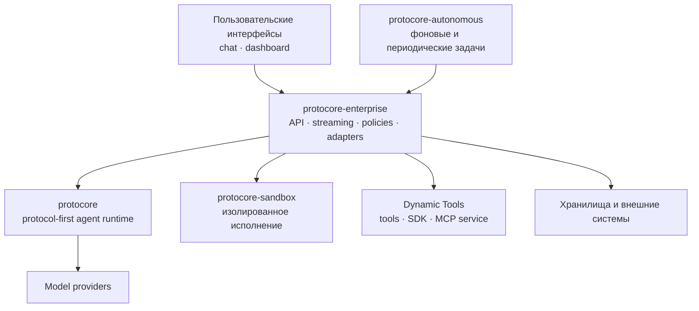

<picture>
  
</picture>

 

**Protocol-first runtime · Stateful agent systems · Reproducible research**

 

---

## Protocore

Protocore — разрабатываемая Ascorblack Labs система для построения и эксплуатации stateful AI-агентов. В её основе находится независимое Python-ядро с типизированными контрактами, потоковым циклом выполнения и явными границами между оркестрацией, инфраструктурными адаптерами, сервисами и пользовательскими интерфейсами.

Система охватывает полный жизненный цикл агентного запуска: сессии и состояние, вызовы инструментов, потоковую доставку событий, подтверждение рискованных действий, восстановление выполнения, фоновые задачи, изолированное исполнение и наблюдаемость. Подключения к моделям и внешним системам реализуются через адаптеры и сервисные контракты.

Исходный код Protocore распространяется на условиях **проприетарных лицензий**. Публичные материалы проекта, архитектурные статьи и исследовательские публикации собраны на [protocore.ascorblack.com](https://protocore.ascorblack.com).

## Архитектура

Ключевое ограничение зависимости: чистое ядро не импортирует service-слой или frontend-код. Enterprise-слой связывает runtime с хранилищами и сервисами; интерфейсы общаются с backend по HTTP и потоковым API.

## Репозитории

Разработка разделена по явным зонам ответственности:

| Репозиторий | Стек | Назначение |
| --- | --- | --- |
| `protocore` | Python 3.12+ · Pydantic | Чистое ядро оркестрации: цикл выполнения, контракты, состояние сессии, hooks и runtime invariants. |
| `protocore-enterprise` | Python 3.12+ · FastAPI | Service-слой: API, аутентификация и политики, адаптеры данных, streaming и интеграция runtime. |
| `protocore-autonomous` | Python 3.12+ · FastAPI | Сервис автономных, отложенных и периодических агентных задач. |
| `protocore-sandbox` | Python 3.12+ · FastAPI | Control plane для изолированных сред выполнения. |
| `protocore-chat` | React 19 · Vite · Hono | Пользовательский чат, Hono BFF, потоковые ответы, tool calls и артефакты. |
| `protocore-dashboard` | Next.js 15 · React 19 | Администрирование runtime, агентов, инструментов, сессий и политик. |
| `protocore-tools` | Python 3.12+ | Authoring-репозиторий и delivery workflow для Dynamic Tools. |
| `protocore-tools-sdk` | Python 3.12+ · Pydantic | Минимальные типизированные контракты для авторов инструментов. |
| `protocore-tools-mcp` | Python 3.12+ · FastAPI · MCP | Публикация, хранение и выполнение версий динамических инструментов. |
| `protocore-infra` | Docker Compose | Локальная и сервисная инфраструктура данных. |
| `protocore-platform-gitlab` / `protocore-platform-harbor` | Helm | Самостоятельные platform-компоненты для GitLab и registry. |

Репозитории проекта ведутся приватно. Таблица описывает границы компонентов, а не перечень публичных пакетов.

## Runtime

- **Protocol-first contracts.** Интеграции runtime определяются типизированными интерфейсами, а инфраструктурные реализации находятся за пределами ядра.
- **Stateful execution.** Сессия, workspace, артефакты и состояние выполнения сохраняются между шагами и могут быть восстановлены после прерывания.
- **Streaming by design.** Текстовые дельты и runtime-события передаются пользовательским интерфейсам по мере появления.
- **Three-layer tool surface.** Ядро предоставляет встроенные инструменты, enterprise добавляет сервисные возможности, Dynamic Tools подключаются во время работы через отдельный delivery и MCP-контур.
- **Explicit control boundaries.** Approval policies, ограничения workspace и изолированное выполнение отделяют решение модели от фактического воздействия на внешние системы.
- **Observable execution.** События, tool calls, usage и состояние запуска доступны service-слою для диагностики и аналитики.

## Проверяемая инженерная база

По состоянию на **16 июля 2026 года**:

| Проверка | Результат |
| --- | ---: |
| Собранные тесты `protocore` | 2 310 |
| Собранные тесты `protocore-enterprise` | 5 128 |
| Branch coverage `protocore` | 91% |

Это датированный snapshot локальной верификации, а не постоянно обновляемая метрика. Актуальные результаты и методики публикуются вместе с соответствующими материалами проекта.

## Исследования

Исследовательская работа Protocore посвящена измеримому поведению tool-using agents и runtime-механизмов, а не только итоговым ответам модели. Текущие направления публикаций:

- runtime-driven convergence при генерации ограниченных по длине артефактов;
- artifact-grounded evaluation агентных систем;
- protocol-first архитектура stateful agent runtime.

Статьи, экспериментальные материалы и PDF-версии публикуются в разделе [Research](https://protocore.ascorblack.com/research/). Каждая численная оценка в публикациях сопровождается описанием методики и границ применимости.

## Технологии

## Контакты

**Основатель — [Александр Тихонов](https://ascorblack.ru)** ([@ascorblack](https://github.com/ascorblack)), AI Systems Engineer из Санкт-Петербурга.

---

© 2026 Ascorblack Labs · Все права защищены

