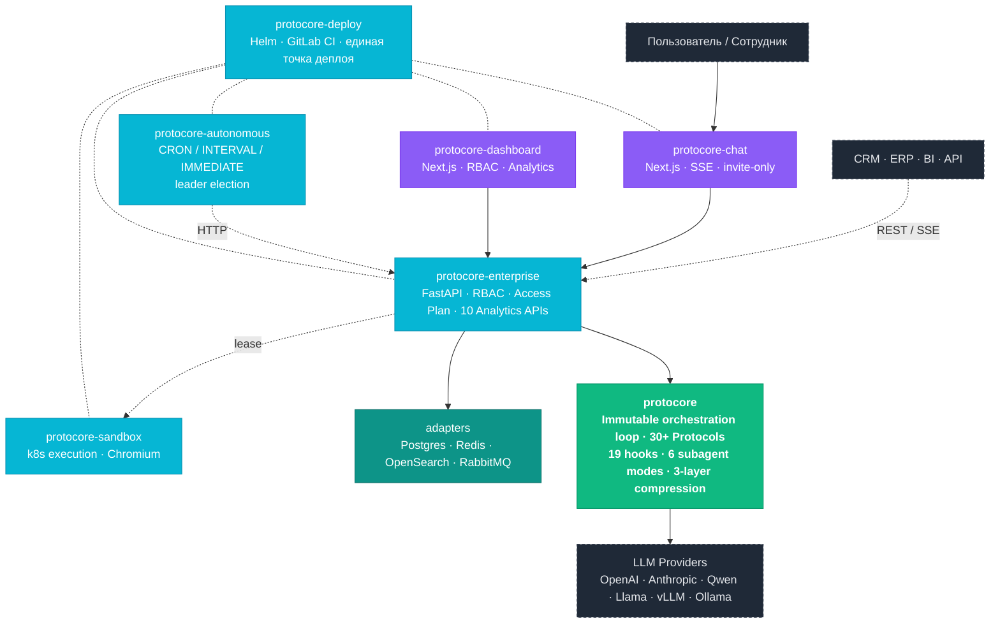

<picture>
  
</picture>

 

**Self-hosted AI agent orchestration · Protocol-first runtime · Enterprise control plane**

 

---

## О проекте

**Protocore** — платформа оркестрации AI-агентов с протокольной архитектурой, разработанная как готовый продукт, а не фреймворк. Разворачивается в контуре заказчика, работает с любой OpenAI-совместимой моделью (GPT, Claude, Qwen, Llama, vLLM, Ollama, GigaChat) — без vendor lock-in и без отправки данных наружу.

Архитектура спроектирована вокруг проблем, которые плохо закрываются типовыми agent SDK: галлюцинаций, неконтролируемого расхода токенов, потери данных при сбоях, отсутствия observability и self-hosted развертывания. Под каждую — конкретное системное решение: проверка tool-result consistency, прогрессивная загрузка инструментов и KV-cache, structured failure classification с ResultSalvage, 10 аналитических API и worktree-изоляция параллельных агентов.

<table>
<tr>
  <td align="center" width="25%">
    <h2>7 500+</h2>
    тестов качества
  </td>
  <td align="center" width="25%">
    <h2>96%</h2>
    покрытие ядра
  </td>
  <td align="center" width="25%">
    <h2>57 / 30+ / 85+</h2>
    модулей · протоколов · событий
  </td>
  <td align="center" width="25%">
    <h2>100%</h2>
    self-hosted, 152-ФЗ
  </td>
</tr>
</table>

---

## Архитектура

**Принцип:** зависимости строго сверху вниз — `protocore` (чистое ядро, без upward-imports) → адаптеры → service-слой → frontend (HTTP/SSE only). Граница ядра защищена тестом импорта (`tests/test_core_import_boundary.py`).

---

## Компоненты

| Репозиторий | Стек | Назначение |
|---|---|---|
| [**protocore**](https://github.com/ascorblack-labs/protocore) | Python 3.12 · Pydantic v2 | Иммутабельный цикл оркестрации, 30+ типизированных протоколов, 19 хуков (pluggy), 6 режимов субагентов, 3-уровневое сжатие контекста, structured failure classification, scratchpad, plan verification, runtime invariants. **4 863 теста, 96% покрытия.** |
| [**protocore-enterprise**](https://github.com/ascorblack-labs/protocore-enterprise) | FastAPI · asyncio | Продакшн-дистрибуция: PostgreSQL/Redis/OpenSearch/RabbitMQ адаптеры, RBAC (8 ролей), Access Plan с квотами и breach-политиками, persona management, SSE-стриминг, 10 аналитических API, метрики. **2 665 тестов, 84% покрытия.** |
| [**protocore-autonomous**](https://github.com/ascorblack-labs/protocore-autonomous) | FastAPI · asyncio | Standalone микросервис автономных задач. CRON/INTERVAL/IMMEDIATE триггеры, Postgres advisory-lock leader election, архивация, статус-стриминг через Redis pub/sub. |
| [**protocore-sandbox**](https://github.com/ascorblack-labs/protocore-sandbox) | Python 3.12 · Kubernetes | Sandbox control plane: lease/claim/release, k8s execution backend, профили рантайма, изолированное выполнение кода с Chromium для веб-задач. |
| [**protocore-dashboard**](https://github.com/ascorblack-labs/protocore-dashboard) | Next.js 15 · React 19 · TS | Админ-панель: агенты, маршрутизация, сессии, трейсы, RBAC, навыки, шаблоны, Access Plans, автономные задачи, workspace-политики, runtime constants. |
| [**protocore-chat**](https://github.com/ascorblack-labs/protocore-chat) | Next.js 15 · React 19 · TS | Чат-приложение с invite-only авторизацией, SSE-стримингом, approval workflow, визуализацией tool calls и артефактов, лендинг-страницей. |
| [**protocore-deploy**](https://github.com/ascorblack-labs/protocore-deploy) | Helm · Bash · GitLab CI | **Единственная** точка деплоя: environment overlays, release-топология, bootstrap-скрипты, registry pull secrets, rollout ordering. |

---

## Что отличает Protocore

<picture>
  
</picture>

---

## Сравнение с альтернативами

| Критерий | **Protocore** | Штатный аналитик | Заказная разработка | GigaChat / YandexGPT |
|---|---|---|---|---|
| Стоимость | **от 100 тыс./мес** | от 150 тыс./мес | 3–15 млн единоразово | от 15 тыс./мес (только API) |
| Данные у вас | **Self-hosted** | да | да | облако провайдера |
| Мульти-агентность | **6 режимов** | — | зависит от ТЗ | — |
| Запуск | **1–2 недели** | найм + онбординг | 3–6 месяцев | 1 день, но только чат |
| Масштабирование | **любые задачи** | 1 человек = 1 задача | каждый кейс — доработка | только чат |
| RBAC и контроль | **8 ролей · Access Plan** | вручную | зависит от ТЗ | API-ключи |
| Аналитика | **10 API · Dashboard** | — | доплата | базовая |
| Автозапуск по расписанию | **CRON / INTERVAL** | напоминания | доплата | — |

**Архитектурные акценты** vs универсальных agent SDK: protocol-first runtime (30+ типизированных протоколов вместо монолита), KV-cache и progressive tool discovery, проверка tool-result consistency, structured failure classification с ResultSalvage, self-hosted и vendor-agnostic — направления, которые универсальные SDK обычно оставляют на усмотрение пользователя.

---

## Как работает оркестрация

  

Главный режим — **LEADER**: лидер-агент видит остаток бюджета, делегирует субагентам в worktree-изолированных копиях, читает структурированные ошибки через contamination firewall и передаёт обратную связь при повторной делегации. Subagent retry с контекстом лидера превращает команду в самообучающуюся сеть — каждая попытка лучше предыдущей.

---

## Сценарии применения

<table>
<tr>
<td width="50%" valign="top">

#### Динамическая отчётность

Агент подключается к БД, собирает данные, строит графики и генерирует готовый отчёт с выводами. По запросу или по расписанию.

> *«Отчёт по продажам за март с разбивкой по регионам»* → через 3 минуты PDF с 4 графиками и аналитическими выводами.

`SQL` `Визуализация` `CRON` `Sandbox`

</td>
<td width="50%" valign="top">

#### База знаний для сотрудников

Агент отвечает на вопросы по внутренним регламентам, документам, процедурам. Новый сотрудник получает ответы за секунды, а не ищет неделями.

> *«Какой порядок согласования договоров от 500 тыс.?»* → актуальный регламент с цитатой и пошаговой инструкцией.

`RAG` `Цитаты` `Persona` `RBAC`

</td>
</tr>
<tr>
<td width="50%" valign="top">

#### Обработка обращений

Классификация входящих, извлечение данных, черновик ответа, маршрутизация. **60–70% типовых запросов** обрабатываются автоматически.

> Обращение → классификация → извлечение № заказа → поиск в CRM → черновик → на утверждение менеджеру.

`Классификация` `API` `Approval` `Маршрутизация`

</td>
<td width="50%" valign="top">

#### Чат с проверенными ответами

Чат-интерфейс, отвечающий строго по вашему контенту. Нумерованные цитаты, ссылки на источники. **Снижение риска галлюцинаций** за счёт цитирования, policy gates и проверки tool-result consistency.

> Образовательная платформа (330+ вузов): студенты задают вопрос → агент отвечает строго по учебникам с цитатами.

`RAG` `Цитирование` `SSE` `Сессии`

</td>
</tr>
</table>

**Отрасли:** финтех и страхование · ритейл · телеком · образование · госсектор · промышленность.

---

## Качество кода

| Метрика          | Core (`protocore`) | Enterprise (`protocore-enterprise`) |
|------------------|--------------------|-------------------------------------|
| Тесты            | **4 863**          | **2 665**                           |
| Покрытие         | **96%**            | **84%**                             |
| Минимальный порог| ≥96%               | ≥80%                                |
| Линтер           | `ruff`             | `ruff`                              |
| Типы             | `mypy --strict`    | `mypy --strict`                     |
| Безопасность     | `bandit` + `pip-audit` | `bandit` + `pip-audit`           |

**Итого: 7 500+ тестов** на ядро + enterprise. CI блокирует merge при падении любого порога.

---

## Технологический стек

&nbsp;

&nbsp;

&nbsp;

---

## Текущий статус

**Активная разработка с действующей продакшн-средой.** Полный стек развёрнут и работает: backend, админ-панель, чат-клиент, sandbox, автономный воркер, единая точка деплоя через Helm + GitLab CI.

Публичная точка входа — [protocore.ascorblack.ru](https://protocore.ascorblack.ru)

---

## Команда и контакты

**Основатель — [Александр Тихонов](https://ascorblack.ru)** ([@ascorblack](https://github.com/ascorblack)), AI Systems Engineer из Санкт-Петербурга. Специализация: агентная оркестрация, поисковая инфраструктура, backend-разработка, интеграционные API.

---

© 2026 Ascorblack Labs · Все права защищены

